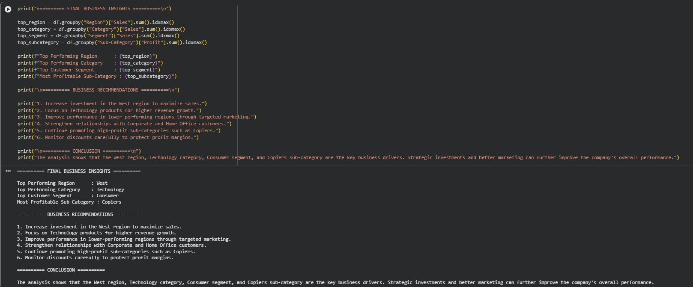

# 📊 End-to-End Data Analytics Case Study

1. 📌 Project Overview

This project demonstrates a complete end-to-end data analytics workflow using the Sample Superstore dataset. It covers the entire analytics process, from understanding the business problem to generating actionable insights and business recommendations through data analysis and visualization.

---

2. 🎯 Objectives

- Understand the business problem
- Analyze sales performance using business KPIs
- Identify top-performing regions, categories, and customer segments
- Discover the most profitable product sub-categories
- Generate executive-level business insights
- Provide data-driven business recommendations

---

3. 🛠️ Tools & Technologies

- Python
- Pandas
- Matplotlib
- Google Colab / Jupyter Notebook
- GitHub

---

4. 📊 Analysis Workflow

- Business Problem Definition
- Data Loading
- KPI Calculation
- Sales by Region Analysis
- Sales by Category Analysis
- Customer Segment Analysis
- Profitability Analysis
- Executive Business Insights
- Business Recommendations
- Final Report Preparation

---

5. 📈 Key Performance Indicators (KPIs)

- Total Sales
- Total Profit
- Total Orders
- Total Quantity Sold
- Average Discount
- Profit Margin

---

5. 🔍 Key Insights

- 🌍 Top Performing Region: **West**
- 💻 Top Performing Category: **Technology**
- 👥 Top Customer Segment: **Consumer**
- 💰 Most Profitable Sub-Category: **Copiers**

---

6. 💡 Business Recommendations

- Increase investment in the West region to maximize sales.
- Focus on Technology products for higher revenue growth.
- Improve performance in lower-performing regions through targeted marketing.
- Strengthen relationships with Corporate and Home Office customers.
- Continue promoting high-profit sub-categories such as Copiers.
- Monitor discounts carefully to protect profit margins.

---

7. 📷 Project Output



---

8. 📁 Project Structure

```
Project-10-End-to-End-Data-Analytics-Case-Study/
│── Project_10_End_to_End_Data_Analytics_Case_Study.ipynb
│── End_to_End_Data_Analytics_Report.pdf
│── Dashboard_Output.png
│── README.md
```

---

9. ✅ Conclusion

This project demonstrates the complete data analytics lifecycle—from understanding a business problem to extracting insights and providing strategic recommendations. It highlights how data can support better business decisions and improve organizational performance.
